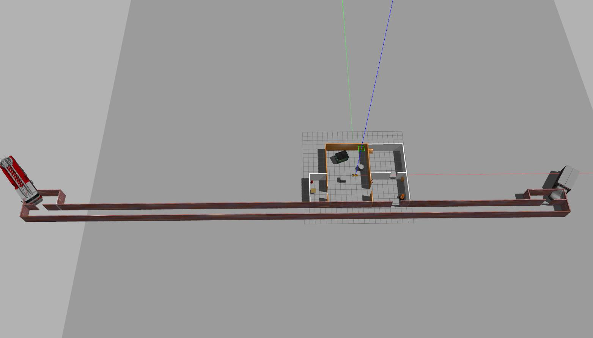

# WoLF: Whole-body Locomotion Framework for quadruped robots

This repo contains a collection of various gazebo resources and worlds used with WoLF.

## Setup

See the documentation [here](https://github.com/graiola/wolf-setup/blob/master/README.md).

## How to add a new world

You can simply add a new world in the `worlds` folder, while the gazebo models can be placed in the `models` folder if needed.

To launch the world with WoLF:

`roslaunch wolf_controller wolf_controller_bringup.launch world_name:=new_world`

## Worlds

|   |   |   |   | 
|:-:|:-:|:-:|:-:|
| <figure>  <figcaption> agriculture </figcaption> </figure> | <figure>  <figcaption> building </figcaption> </figure> | <figure>  <figcaption> inspection </figcaption> </figure> |  <figure>  <figcaption> maze </figcaption> </figure>  |
| <figure>  <figcaption> obstacle_avoidance </figcaption> </figure> |  <figure>   <figcaption> office </figcaption> </figure>  | <figure>  <figcaption> park_large </figcaption> </figure> |<figure>  <figcaption> pyramid </figcaption> </figure>   | 
|<figure>  <figcaption> ruins </figcaption> </figure>  | <figure>  <figcaption> stairs </figcaption> </figure> | <figure>  <figcaption> postoffice </figcaption> </figure> | <figure>  <figcaption> rough_terrain </figcaption> </figure> | 

### Note:

To be able to load the new models in gazebo you need to append the path to the `GAZEBO_MODEL_PATH`, for example:

`export GAZEBO_MODEL_PATH=$GAZEBO_MODEL_PATH:/your_path_to/wolf_gazebo_resources/models`

### Legal notes

 For the world descriptions all rights belong to their respective owners.
